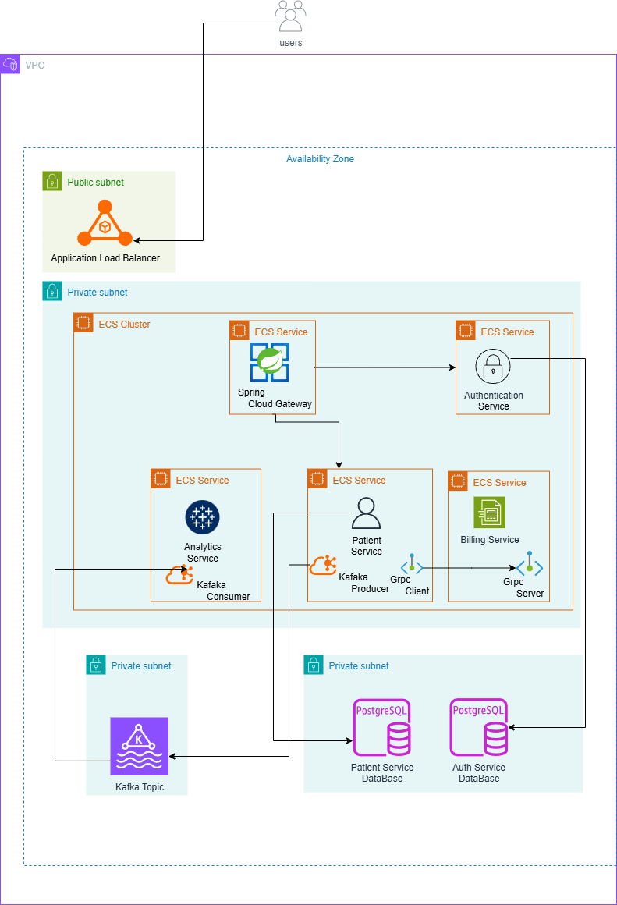

# 🏥 Patient Management Microservices Platform

A cloud-native microservices platform for managing patient data, billing, authentication, and analytics — built with **AWS ECS**, **Kafka**, and **PostgreSQL**.

---

## 🧠 Overview

This project demonstrates a **scalable, event-driven microservices architecture** deployed on **Amazon Web Services (AWS)**.  
It leverages **ECS (Elastic Container Service)** for container orchestration, **Kafka** for asynchronous communication, and **PostgreSQL** for data persistence.

Users interact with the system through a **public Application Load Balancer**, which routes requests to backend microservices running inside a **private VPC**.

---

## ☁️ Architecture

### Key Design Points
- **Public Subnet** hosts only the Application Load Balancer (internet-facing).
- **Private Subnets** host all ECS services, Kafka, and PostgreSQL databases.
- **Kafka** enables asynchronous communication between microservices.
- **gRPC** is used for high-performance internal communication.
- **Each service** has its own database for data isolation and scalability.

---

## 🧩 Tech Stack

**Backend**
- AWS ECS (Fargate)
- Kafka (MSK)
- gRPC
- PostgreSQL
- Spring Boot

**Cloud Infrastructure**
- AWS VPC (with public/private subnets)
- Application Load Balancer
- ECS 
- MSK

**Communication**
- REST (via API Gateway Service)
- gRPC (for internal service-to-service calls)
- Kafka Topics for event streaming

---

## ⚙️ Microservices Overview

| Service | Description |
|----------|--------------|
| **Authentication Service** | Manages user authentication and authorization. |
| **Patient Service** | Handles patient registration, data management, and interactions. |
| **Billing Service** | Processes billing and payments through gRPC communication. |
| **Analytics Service** | Consumes Kafka events for patient and billing insights. |
| **API Gateway Service** | Entry point for external requests; routes traffic to internal services. |

---

## 🚀 Deployment

1. **Containerize** each service using Docker.
2. **Deploy** services to Amazon ECS (Fargate) within private subnets.
3. **Expose** the Application Load Balancer in the public subnet.
4. **Configure Kafka Topics** (Amazon MSK or EC2-hosted Kafka).
5. **Connect Databases** securely using RDS PostgreSQL instances.

---

## 🔒 Security & Networking

- VPC segmented into **Public** (ALB) and **Private** (ECS, DB) subnets.
- Databases are **not publicly accessible**.

---

## 📊 Observability & Scalability

- **Kafka** for handling asynchronous event spikes.
- Future integration planned with **Prometheus + Grafana** for deeper monitoring.

---

## 💡 Future Improvements

- Integrate **CI/CD** pipelines using GitHub Actions 
- Enhance analytics dashboard with visual insights.
---
